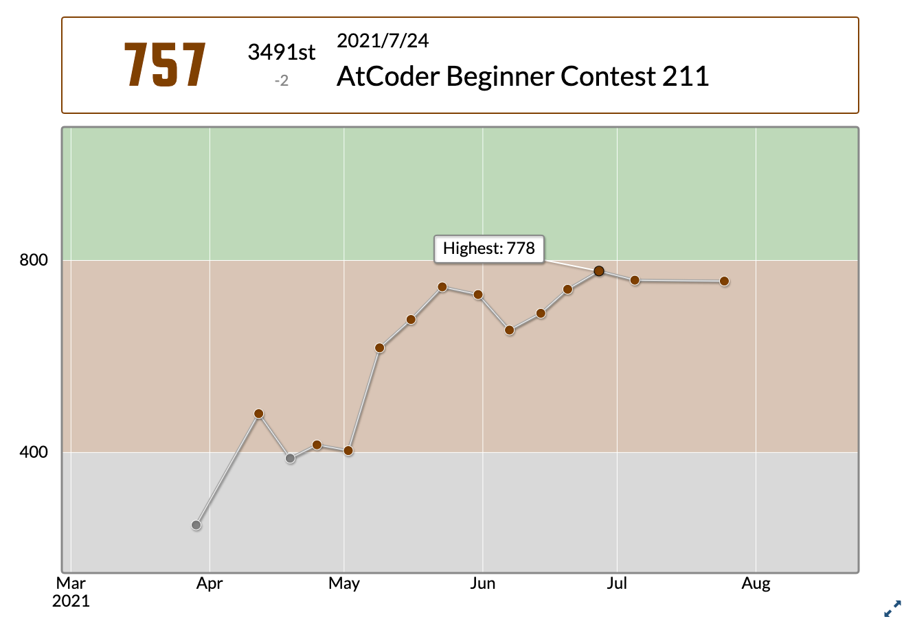
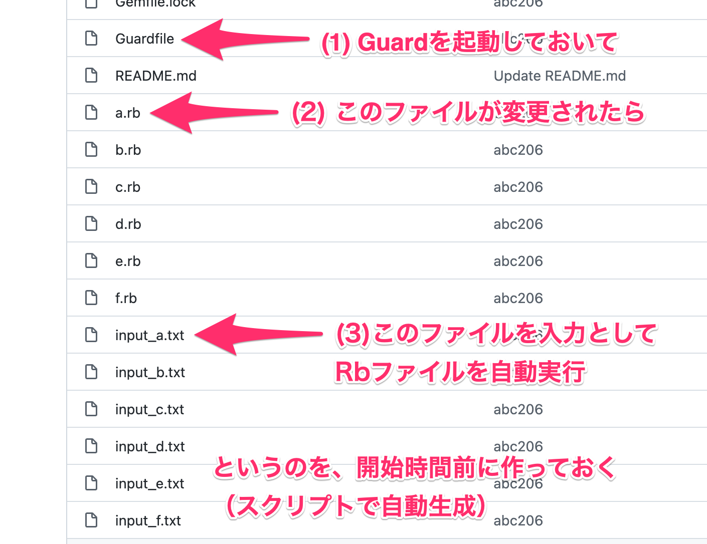
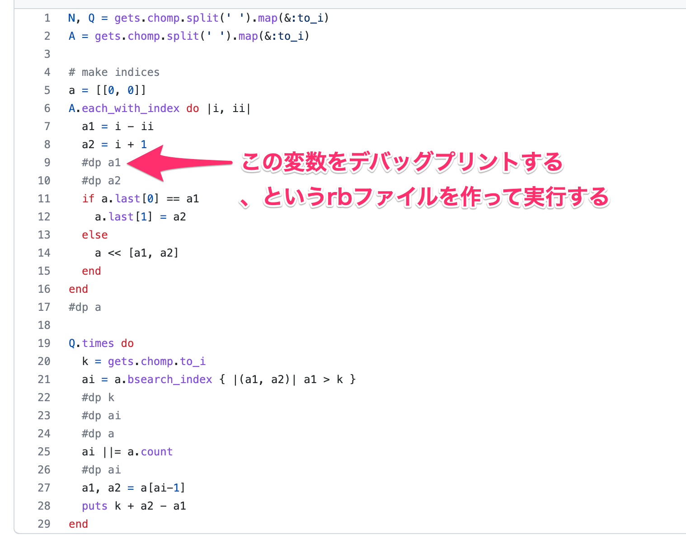
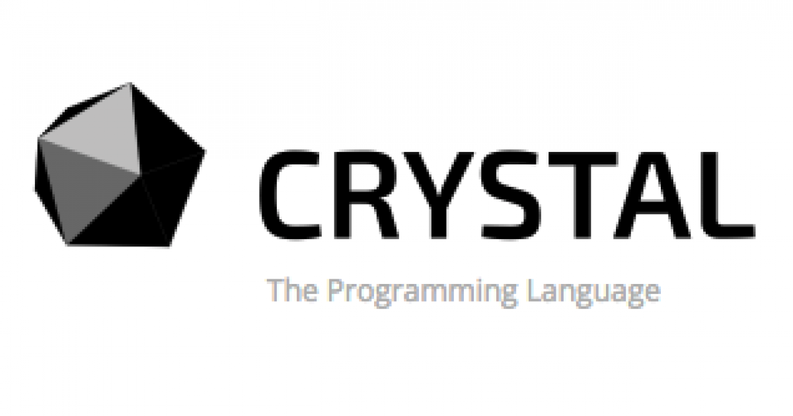

## プログラマにとっての「適度な運動」としての 競技プログラミング 実演編

2022/05/16

黒木 慎介

---

## ここまでのあらすじ

- （Fukuoka.rbでのLT）
- プログラマとしての健康維持のためにコードを書くと良い
- 作りたいものがない時には競技プログラミングをやると良い
- 「難しい」「ガチらないといけない」「続けなきゃいけない」すべて誤解である

---

## この発表では？

- やってみせるのがあんまりできなかったので、実演をやっていきます
- 黒木がやった「工夫」のみせびらかし

---

## AtCoder

- 競技プログラミング大手
- ここでやる前提で話します

---

## 期待値の調整/私の成績

緑にすら未到達、ドヤれる成績ではないです

---

## まず簡単な問題で流れを見せます

https://atcoder.jp/contests/practice

---

## 概要

- 「こういう入力が与えられるので、こういう出力を返してください」
  - 計算、並び替え、探索、などなど
- 使うのは標準入力と標準出力
  - 知らない人は少し慣れは必要かも
- 毎週末にみんなが「いっせーの」で解いて、得点を競う
  - いつでも解ける問題も置いてある
- Rubyを含めて、だいたいどんな言語でも挑戦できる

---

## 工夫/最初から正しいコードを提出したい

- 手元で動作確認してから出せば良い
- そのための環境を作って置くと楽

---

## 工夫/私がやったこと

- 手元で動作確認してから出せば良い
- そのための環境を作って置くと楽

---

## 工夫/私がやったこと

---

## 工夫/なんで間違ってるのかわからん時

- デバッグしたい
- でも余計な出力をすると不正解になるので、提出時にはデバッグプリントしない必要がある
- そのための環境を作って置くと楽

---

## 工夫/私がやったこと

---

# 実演

---

## 工夫/処理時間がどうしても足りない時

- 大前提: オーダーが駄目だったら何をしても駄目
  - O(n\^2)が求められる時にO(n\^3)だと駄目
- 求められるオーダーを達成しても、係数で駄目な場合
  - 10nを3nにしないと正解できない、的な
  - Rubyではありがち（つらい）

---

## 工夫/処理時間がどうしても足りない時

---

## プログラミング言語Crystal

- 静的型付けのコンパイル言語
- Rubyとほぼ同じ文法
  - 「ほぼ」というのがポイントで、微妙に違う
- 実行速度がだいぶ速い